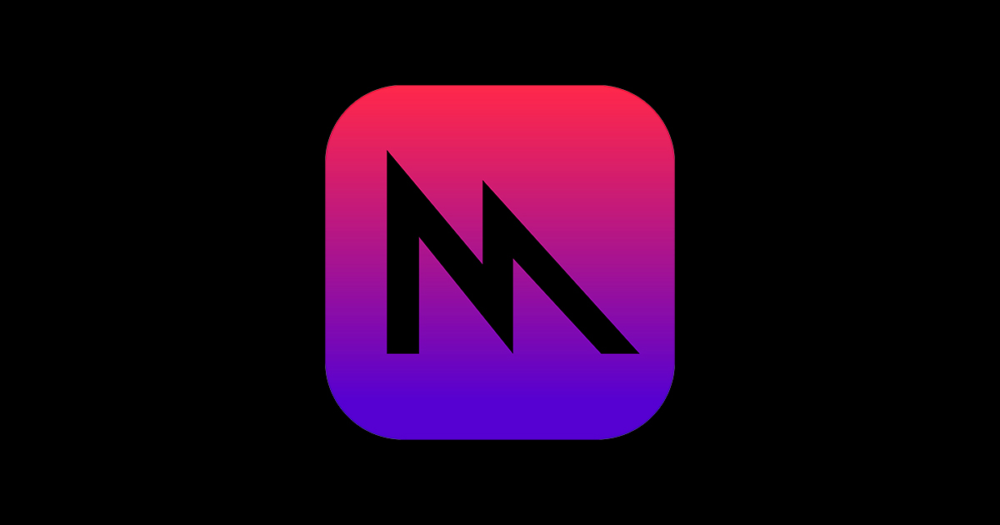

[Back to Portfolio](./)

Metal Shader Language
===============

-   **Language(s): Metal, Swift and SwiftUI** 
-   **Source Code Repository:** [SwiftMetal](https://github.com/rbsquires/SwiftDSA)  
    (Please [email me](mailto:rbsquires@csustudent.net?subject=GitHub%20Access) to request access.)

## Project description

Learning to do Metal shaders and animations in SwiftUI.

*Fig 1. Under Construction, will update as I progress through learning Metal*

[Back to Portfolio](./)