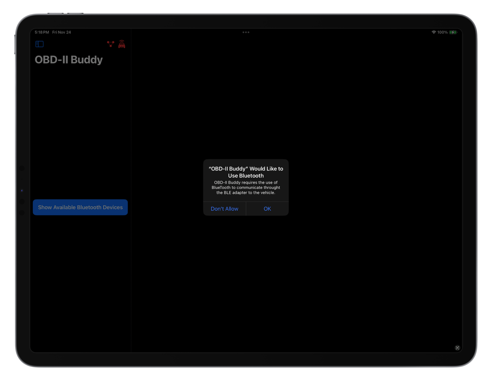
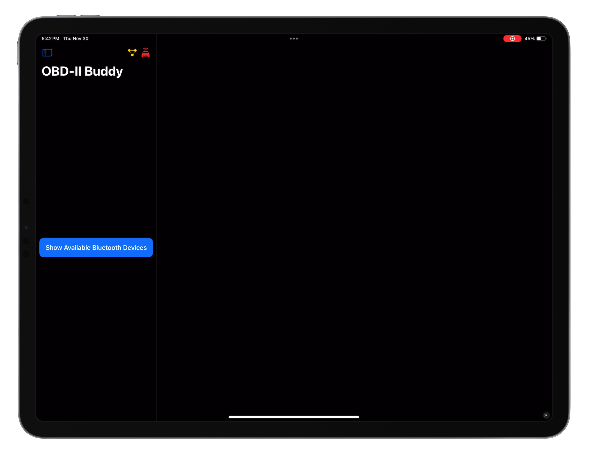
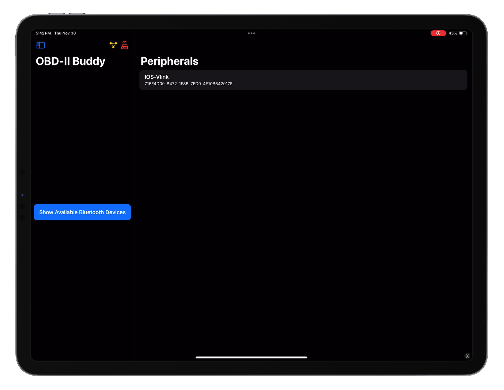
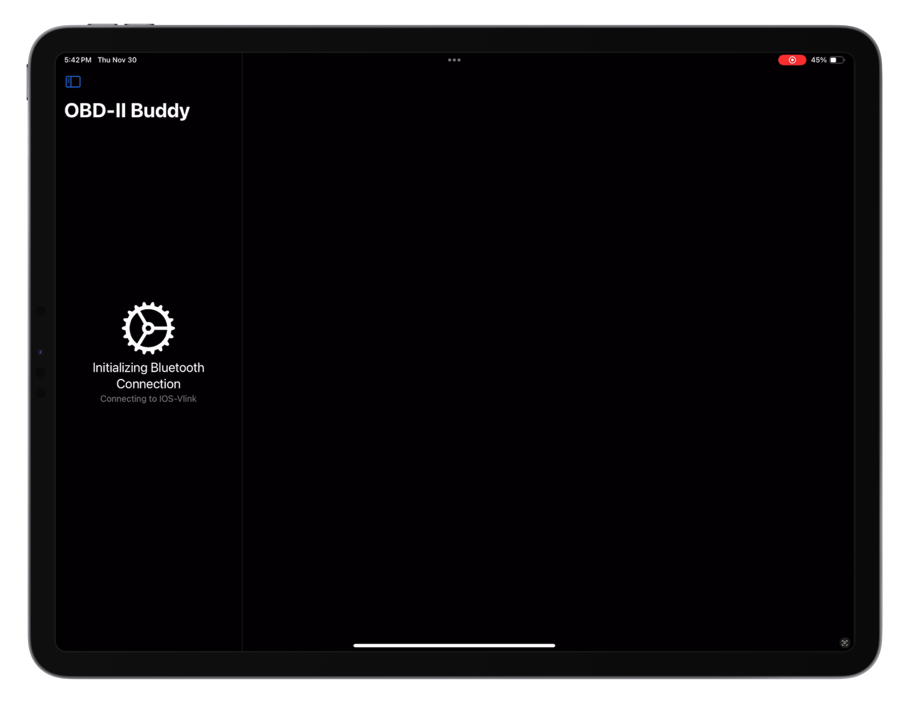
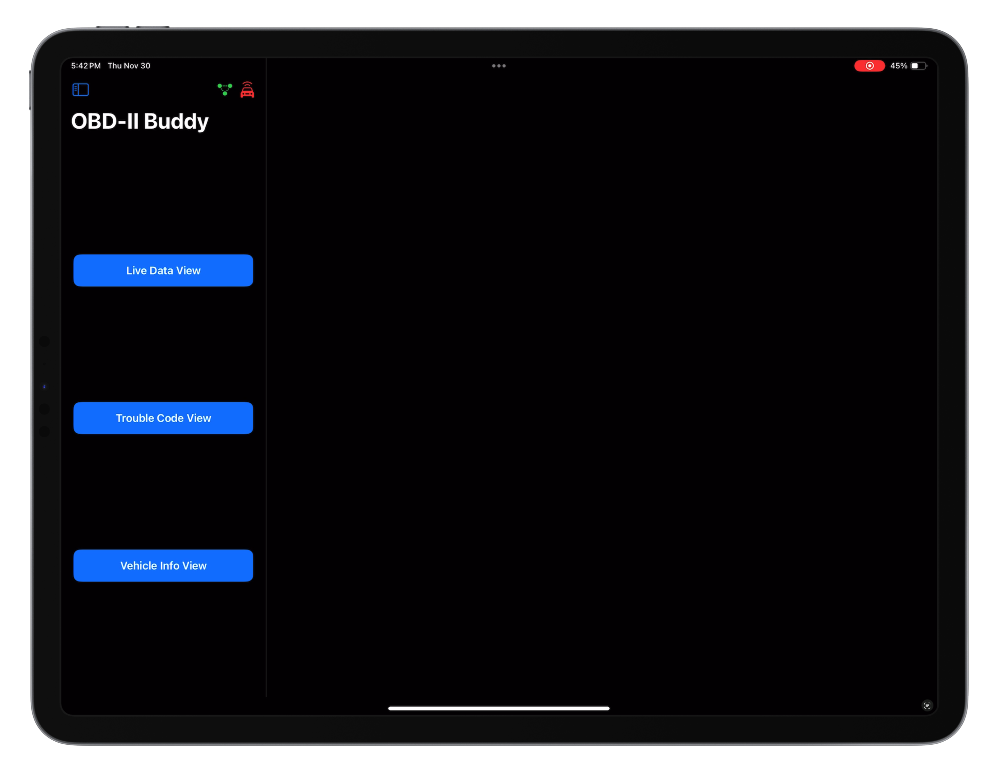
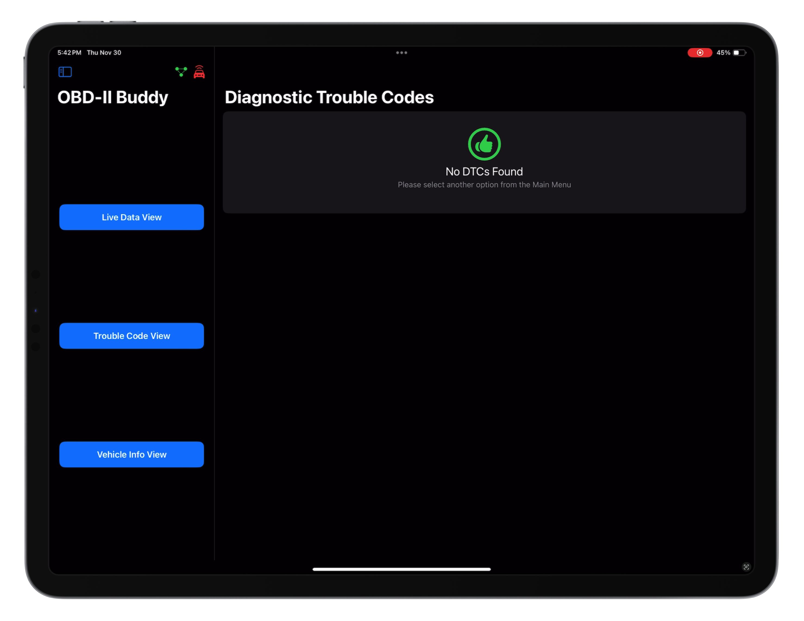

[Back to Portfolio](./)

OBD-II Buddy
===============

-   **Class: Capstone Project** 
-   **Grade: A** 
-   **Language(s): Swift and SwiftUI** 
-   **Source Code Repository:** [Capstone Project](https://github.com/rbsquires/CSU-Capstone-Project)

## Project description

This application will allow you connect to your vehicle's OBD-II port via Bluetooth BLE adapter, using your Apple Devices (iPhone & iPad) to read information such as:
- Engine RPM
- Coolant Temperature
- Battery Voltage
- Engine Load
- Throttle Position

## How to compile and run the program

- To get started, clone the repo
- Open the project in Xcode
- Turn your iPhone or iPad developer mode *ON*
- Connect your iPhone or iPad to your Mac
- Select your device in Xcode

```Swift
cmd(⌘) + r
```

## UI Design

**Once the app has been loaded onto your device, it will be useable as long as developer mode is on*

The user needs to  ensure that their OBD-II BLE device is fully connected to the ODD-II port under the dash. The user can then turn their vehicle's key to the on position or start the vehicle. Then start the app by tapping the OBD-II Buddy app icon (see Fig 1).


*Fig 1. Device Home Screen*

The user is prompted to allow OBD-II Buddy Bluetooth access on their device. The app uses Bluetooth to communicate with the vehicle through the OBD-II BLE adapter. Tap "OK" to continue (see Fig 2).



*Fig 2. Bluetooth usage authorizarion*

Next, the user can scan for their OBD-II BLE adapter by tapping on "Show Available Bluetooth Devices" (see Fig 3).



*Fig 3. View available Bluetooth devices*

On the Peripherals view, the user will the see available OBD-II BLE adapter(s). In this case iOS-Vlink. Tap on the name of the adapter to connect OBD-II Buddy to your vehicle (see Fig 4).



*Fig 4. Connecting to your vehicle through the BLE adapter*

The user will be shown a loading screen while the app initializes the Bluetooth connection and starts communication with the vehicle (see Fig 5).



*Fig 5. Initializing Bluetooth connection and communication with vehicle*

The user will now be shown the Home Screen of OBD-II Buddy. The user can tap one of the available option on the screen. The triple dot symbol at the top of the screen shows the status of your *Bluetooth* connection. In this case green means *Bluetooth* is connected (see Fig 6).



*Fig 6. OBD-II Buddy Home Screen*

If the user tapped the "Live Data View" they will be shown the live data for four sensors on their vehicle. Notice the car at the top is now green. While communicating with the vehicle, the app will animate this car symbol and it will be colored green (see Fig 7).


*Fig 7. OBD-II Buddy Live Data View*

The user can change the sensors that are being read by tapping on any of the sensor's data locations and they will be shown the other sensors that their vehicle supports. To change to a different sensor tap on the desired sensor from the list (see Fig 8). The current sensor for that positon on the screen has a green check mark, while the other sensors are marked "In Use" and are disabled from selection.


*Fig 8. OBD-II Buddy sensor customization*

The user may leave the Live Data View at anytime, by double tapping on the OBD-II Buddy image in the middle of the view. Note that on iPad there is slightly different functionality. Once the OBD-II Buddy image is double tapped, the Live Data View will disappear, showing optional directions to the user (see Fig 9).


*Fig 9. Closing Live Data View*

If the user tapped "Trouble Code View" they will be shown a list of any active DTCs that their vehicle is currently storing. The user can look these codes up online to help determine what problem their vehicle has. In this case, there are no DTCs and the UI displays that to the user (see Fig 10).



*Fig 10. Trouble Code View, no DTCs*

If the user tapped "Vehicle Info View" they will be shown a list of generic vehicle information. This includes their VIN, Calibration ID, OBD-II Protocol, ECU Name, and Fuel Type (see Fig 11).


*Fig 11. Vehicle Info View*

To exit the application, use typical Apple app closure. Swipe up from the bottom and dismiss the app. This will disconnect from the BLE adapter and end communication with the vehicle.

## 3. Additional Considerations

### Changing the BLE device information:

Inside BluetoothService.swift, the user can attempt to use an OBD-II BLE device other than the specified iOS-VLink device. To communicate with the device, ensure that you know the devices read/write characteristic UUID and swap it into the if statement. Alternatively, with added print statements the user could find the device and it's characteristics by removing the if statement here and in the next code block.

```Swift
// Function used to discover characteristics of the Bluetooth peripherals in your area
func peripheral(_ peripheral: CBPeripheral, didDiscoverCharacteristicsFor service: CBService, error: Error?) {
    for characteristic in service.characteristics ?? [] {
        // Only allowing the vehicle communication code to be ran for the iOS-Vlink BLE device
        if (String(describing: characteristic.uuid)) == "BEF8D6C9-9C21-4C9E-B632-BD58C1009F9F" {
            ...
        }
        ...
    }
    ...
}
```

Inside AvailableDeviceView.swift, the user can remove the if statement to view all nearby Bluetooth devices if they are unsure on the UUID of their OBD-II BLE device. Once found, that information can be swapped into the if statement to only show their BLE device.
```Swift
Form {
    // List of Bluetooth peripherals in your area, remove if to see all devices
    List(bluetoothService.peripherals, id: \.self) { peripheral in
        if peripheral.identifier.description == "715F4D00-B472-1F8B-7ED0-4F10B542017E" 
        || peripheral.identifier.description == "4BCC77F9-32AC-0C74-BB65-365ECF59F447" {
            ...
        }
        ...
    }
    ...
}
```

### Editing PIDs:

Inside DataParser.swift, the user can add or remove PIDs. When adding, ensure that you have the correct hex PID, it's data bytes returned, data type returned and description. Next, add the information into each dictionary. Then, ensure that you add the hex PID to myPIDList[].

```Swift

@Published var myPIDList = [String](arrayLiteral: "04", "05", "0A", "0B", "0C", "0D", "0F", "10", "11", "42", "51")

let PIDBytes = [
    "04": 1,
    "05": 1,
    "0A": 1,
    "0B": 1,
    "0C": 2,
    "0D": 1,
    "0F": 1,
    "10": 2,
    "11": 1,
    "42": 2,
    "51": 1
]

let PIDTypes = [
    "04": "%",
    "05": "°F",
    "0A": "psi",
    "0B": "psi",
    "0C": "RPM",
    "0D": "MPH",
    "0F": "°F",
    "10": "g/s",
    "11": "%",
    "42": "V",
    "51": "FuelType"
]

let PIDDescription = [
    "04": "Engine Load",
    "05": "Engine Coolant Temp.",
    "0A": "Fuel Pressure",
    "0B": "Intake Man. Pressure",
    "0C": "Engine Speed",
    "0D": "Vehicle Speed",
    "0F": "Intake Air Temp.",
    "10": "MAF Flow Rate",
    "11": "Throttle Position",
    "42": "Battery Voltage",
    "51": "FuelType"
]
```

[Back to Portfolio](./)
