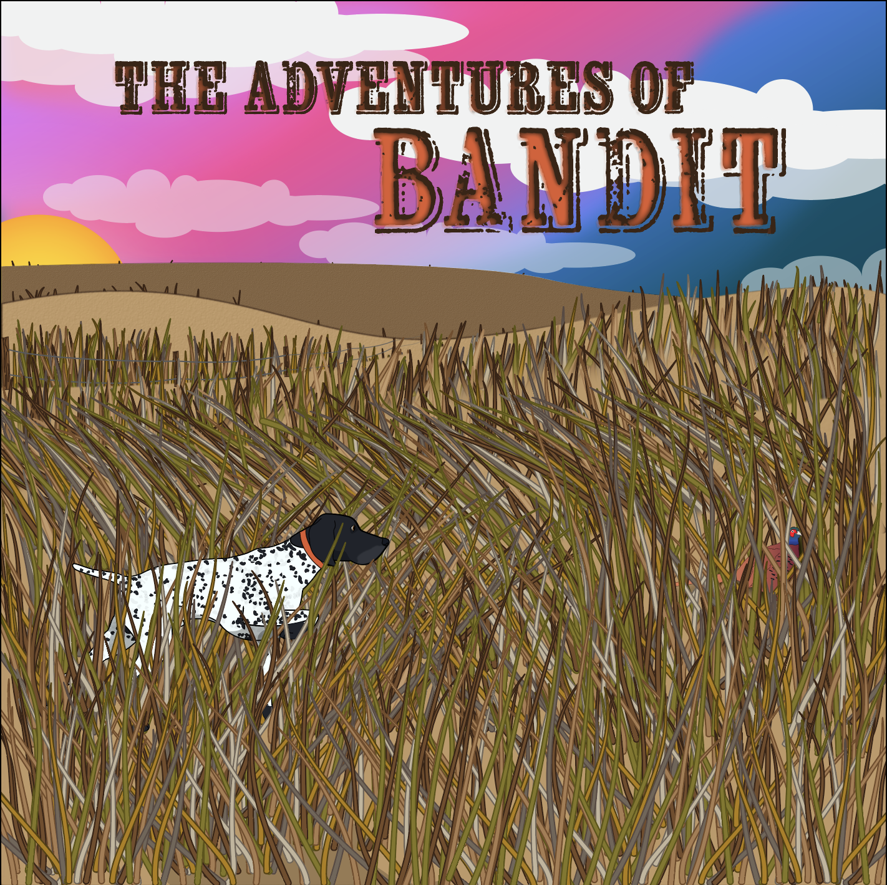

[Back to Portfolio](./)

Children's Book Illustration
===============

-   **Class: Visual Communications** 
-   **Grade: A** 
-   **Tool(s): Adobe Illustrator**   
    (Please [email me](mailto:rbsquires@csustudent.net?subject=GitHub%20Access) to request access.)

## Project description

This assignment was to create a childrens book illustration. The illustration was to contain a creature and an environment,bright colors and a type script for our design.

## Design

I decided to create an illustration of my dog Bandit. The book will contain all of his adventures over the past seven years. He has travelled with me across the country multiple times, from the Atlantic to the Pacific and from the northern to southern US borders.

[Back to Portfolio](./)
