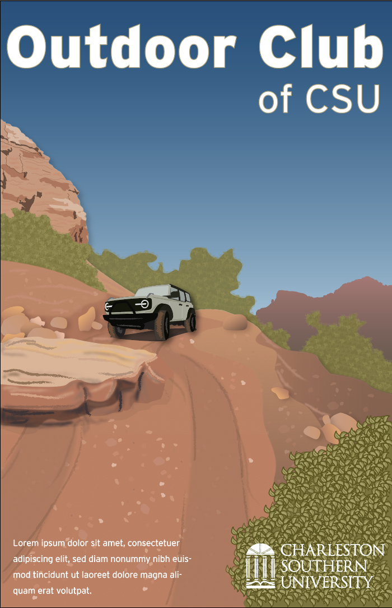
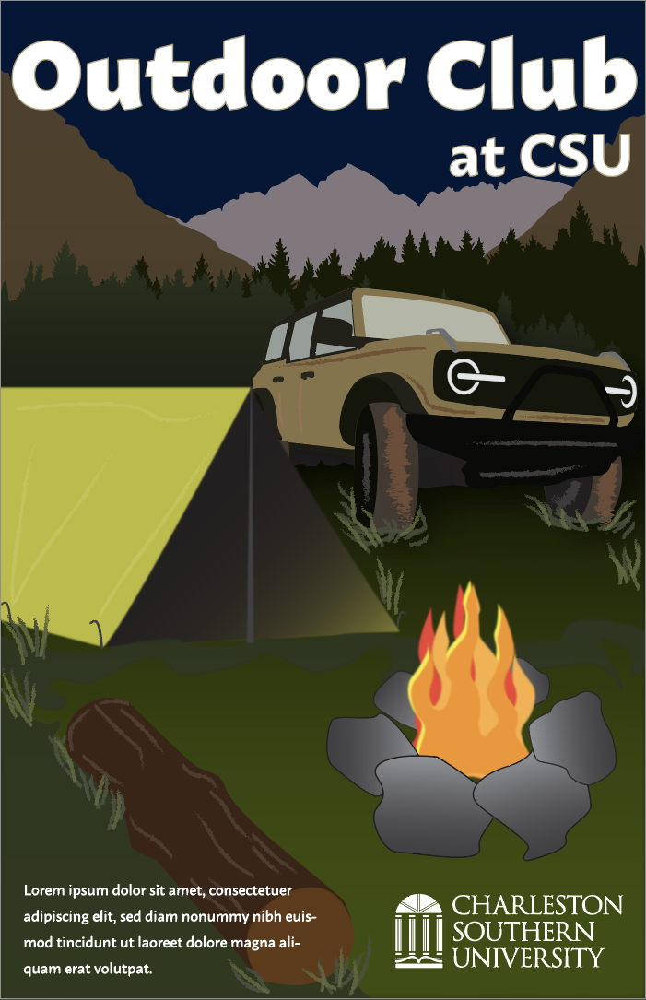
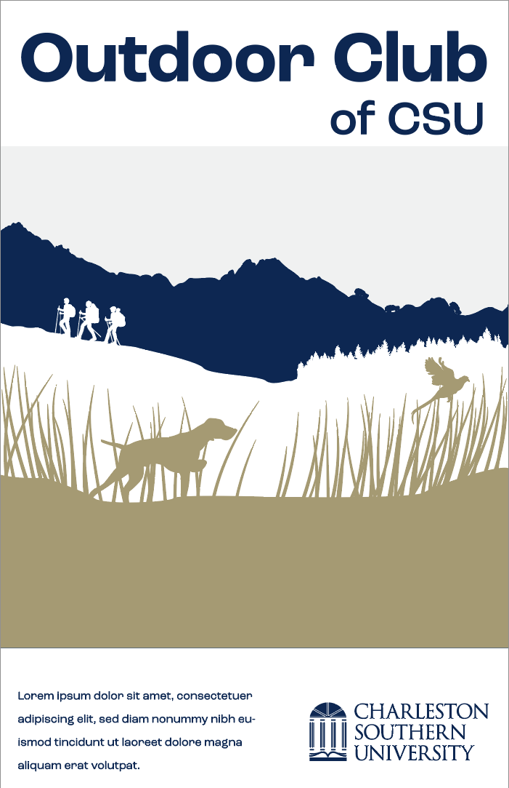

[Back to Portfolio](./)

CSU Event Poster Illustrations
===============

-   **Class: Visual Communications** 
-   **Grade: A** 
-   **Tool(s): Adobe Illustrator**   
    (Please [email me](mailto:rbsquires@csustudent.net?subject=GitHub%20Access) to request access.)

## Project description

This assignment was to create three different posters to advertise an event at CSU. The illustrations were to be designed in our "style" and accompanied by type scripts for the headline, subheadline and body. We conducted type and color studies for our final poster. The entire process book is available upon request.

## Design

I decided to create event posters for an Outdoor Club at CSU. I have a great love for the outdoors, especially when the time spent outdoors involves offroading, hunting or exploring. I wanted to capture this in the different designs for the event. Promoting time for hiking, hunting and going offroading as group activities for the club.

The first illustration is to capture the beauty of wheelin' through Moab.

The second illustration is to capture the full experience of overlanding to a remote location and camping in the great outdoors.

The third illustration is to capture the different activities the club organizes: offroading, hiking and hunting. I wanted to create an illustration to serve as a logo for the club, promoting their activities to those who come across the poster's location.

[Back to Portfolio](./)
