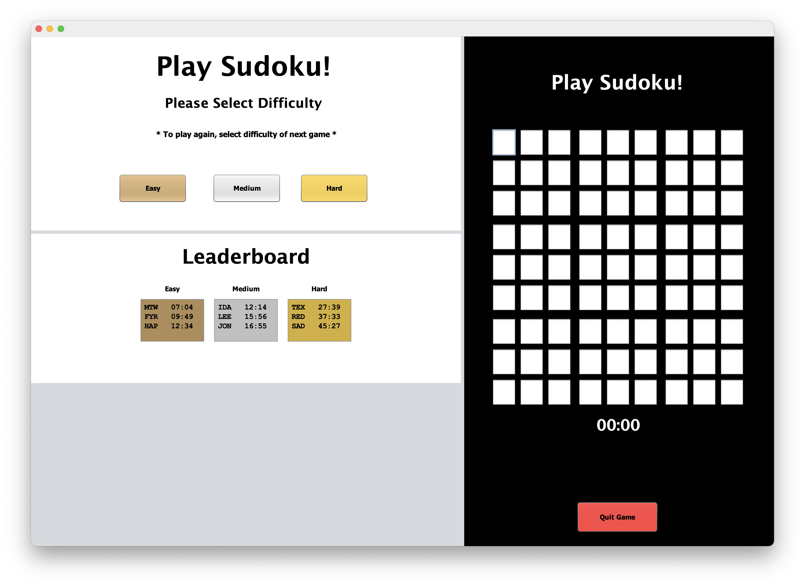

Portfolio
=========

<h2>About Me</h2>
Coder. Gear Head. Gypsy Soul. 

    Meticulous, dedicated college graduate with experience in Computer Science and Web Development
    technologies. Pursuing a
    position to build upon my education and start a career as a Software Engineer specializing in development with
    languages such as Swift, C++ or Java.

 

My Coding Journey

  &emsp;&emsp; I started my coding journey as a Computer Science student with a passion to learn everything I could about making programs that would be useful. Since I use an iPhone, I wanted to teach myself iOS development with a dream to build my own app. Having a background as a mechanic, I chose to make an OBD-II application to bring together my love of vehicles and the technologies I have been learning throughout my education in Computer Science. I enjoy programming in C++ and Java, but have also grown to enjoy using Swift and SwiftUI for programming specifically for Apple devices. I hope to continue growing my developer skill as a whole, as well as become more proficient in iOS, iPadOS, and macOS development.
  
 

---
<h2>Languages and Frameworks</h2>

  

---
<h2>Tools</h2>

          

  

---
<h2>Programming Projects</h2>

*For access to my private project repositories, please [email me](mailto:rbsquires@csustudent.net?subject=GitHub%20Access) with the subject line, GitHub Access.

---
### [HTML Parser | CSCI 315](project1)

---
### [Sudoku (Group Project) | CSCI 325](project2)

---
### [Project 3 Title | CSCI 325](project3)

---
### [5k Charity Run Website | CSCI 334](project4)

---

Ethics Papers
-------------

### [Paper 1 Title](/pdf/sample_presentation.pdf)

-   **Class:**  
-   **Grade:**

### [Paper 2 Title](/pdf/sample_presentation.pdf)

-   **Class:** 
-   **Grade:**

### [Paper 3 Title](/pdf/sample_presentation.pdf)

-   **Class:** 
-   **Grade:**

---

Presentations
-------------

### [Presentation 1 Title](/pdf/sample_presentation.pdf)

- **Class:** 
- **Grade:**

### [Presentation 2 Title](/pdf/sample_presentation.pdf)

- **Class:** 
- **Grade:**

---

Page template forked from <a href="https://github.com/csu-cs/csci-portfolio">CSU-CS</a>

<!-- Remove above link if you don't want to attributive -->
