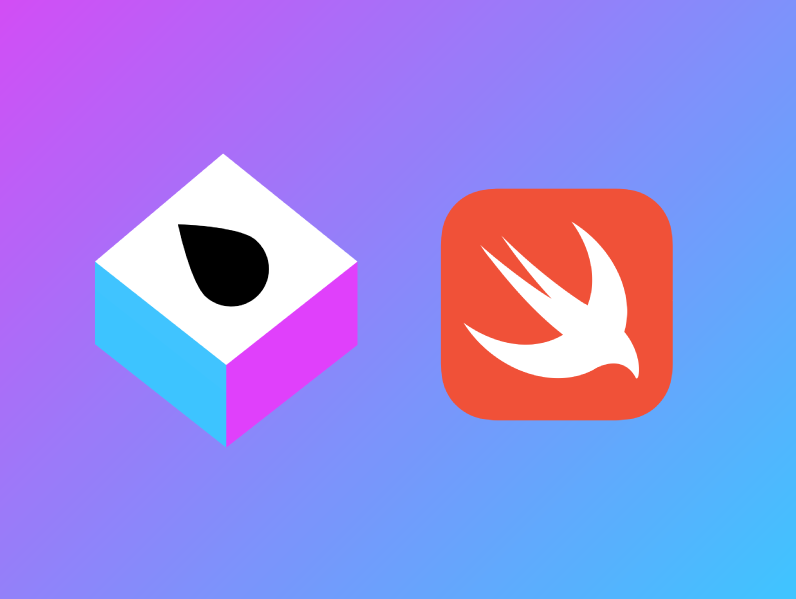
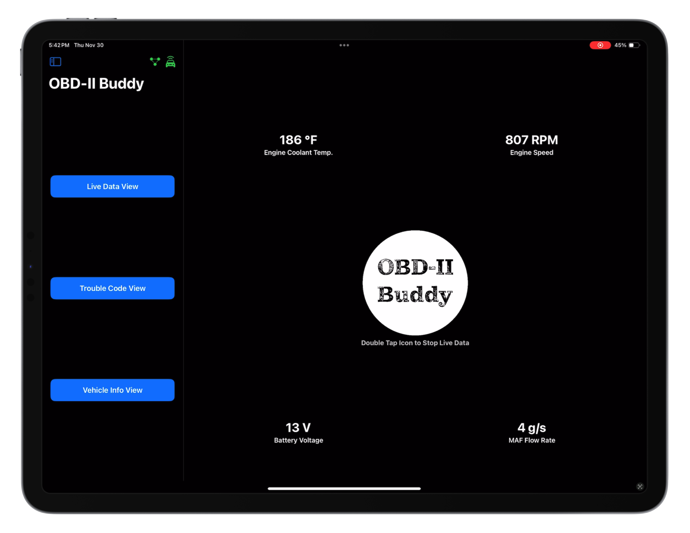
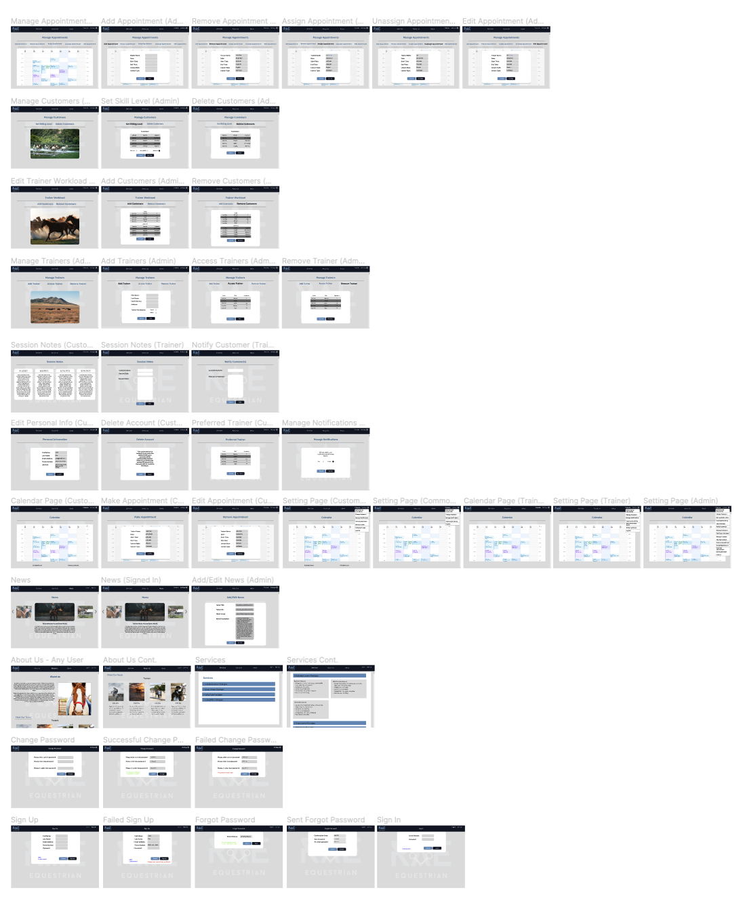
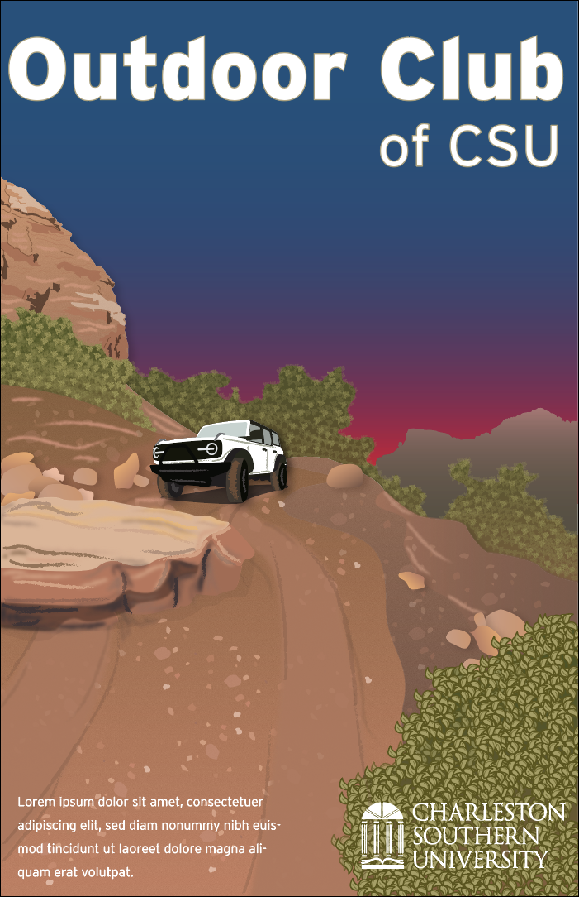

Portfolio
=========

## About Me

Coder. Gear Head. Nomad spirit.

	I’m a software developer focused on expanding my toolbox one language at a time and mastering my craft. The projects in this portfolio are some of my favorite works while completing my B.S. in Computer Science, Minor in Web Development. I'm a meticulous, dedicated professional pursuing a career as a software engineer with languages such as Swift, C++ and Java.

	

		<b>
			My Coding Journey
		</b>
	

	

		&emsp;&emsp;I started my coding journey as a Computer Science student with a passion to learn everything I could about making programs that would be useful. Since I use an iPhone, I wanted to teach myself iOS development with a dream to build my own app. Having a background as a mechanic, I chose to make an OBD-II application to bring together my love of vehicles and the technologies I have been learning throughout my education. I enjoy programming in C++ and Java, but have also grown to enjoy using Swift and SwiftUI specifically for Apple devices. I hope to continue growing my developer skill as a whole, as well as become more proficient in iOS, iPadOS, and macOS development. My next side projects will be learning Fullstack Development in Swift with Vapor, and embedded Swift programming.
	

 

---
## Languages and Frameworks

### Languages:

 

&nbsp;

### Frameworks:

 

&nbsp;

---

## Tools

### Operating Systems:

 

&nbsp;

### IDEs and Source Control:

 

&nbsp;

### Design:

 

&nbsp;

---
## Current Programming Projects

*For access to my private project repositories, please [email me](mailto:rbsquires@csustudent.net?subject=GitHub%20Access) with the subject line, GitHub Access.

---
### [Swift Vapor | Learning Swift Vapor Framework](swiftVapor)

---
### [Swift DSA | Learning Data Structures and Algorithms in Swift](swiftDSA)

---
## Completed Programming Projects

*For access to my private project repositories, please [email me](mailto:rbsquires@csustudent.net?subject=GitHub%20Access) with the subject line, GitHub Access.

---
### [OBD-II Buddy | Capstone Project](capstone)

---
### [Scheduling Algorithms (Group Project) | CSCI 431](project4)

---
### [5k Charity Run Website (Group Project) | CSCI 334](project3)

---
### [Sudoku (Group Project) | CSCI 325](project2)

---
### [HTML Parser | CSCI 315](project1)

---
## Design Projects

---

### [Horse Riding Lessons Website | CSCI 495](webdesign)

---

### [CSU Event Posters | ART 216](finaldesign)

---

### [Childrens Book Illustration | ART 216](design1)

---

Ethics Papers
-------------

### <a href="pdf/CSCI 325 - Ethics Paper - Robert Squires.pdf" target="_blank">Ethics of Data Collection</a>

-   **Class: CSCI 325 - Object Oriented Programming** 
-   **Grade: A**

### <a href="pdf/CSCI 315 - Ethics Paper - Robert Squires.pdf" target="_blank">Ethics of Developer Testing</a>

-   **Class: CSCI 315 - Data Structure Analysis** 
-   **Grade: A**

### <a href="pdf/CSCI 301 - Ethics Paper - Robert Squires.pdf" target="_blank">Ethics of Copyright Law & Plagiarism</a>

-   **Class: CSCI 301 - Survey of Scripting Languages**  
-   **Grade: A**

---

Presentations
-------------

### <a href="pdf/CSCI 352 Forensics Group Project.pdf" target="_blank">Computer Forensics Presentation</a>

- **Class: CSCI 352 - Cyber Defense** 
- **Group: Jaye E., Robert S.**
- **Grade: A**

### <a href="https://youtu.be/TI5XosF6UNU" target="_blank">Sudoku Presentation</a>

- **Class: CSCI 325 - Object Oriented Programming**
- **Group: Mack W., Matt W., Robert S.**
- **Grade: A**

---

Page template forked from <a href="https://github.com/csu-cs/csci-portfolio">CSU-CS</a>

<!-- Remove above link if you don't want to attributive -->
