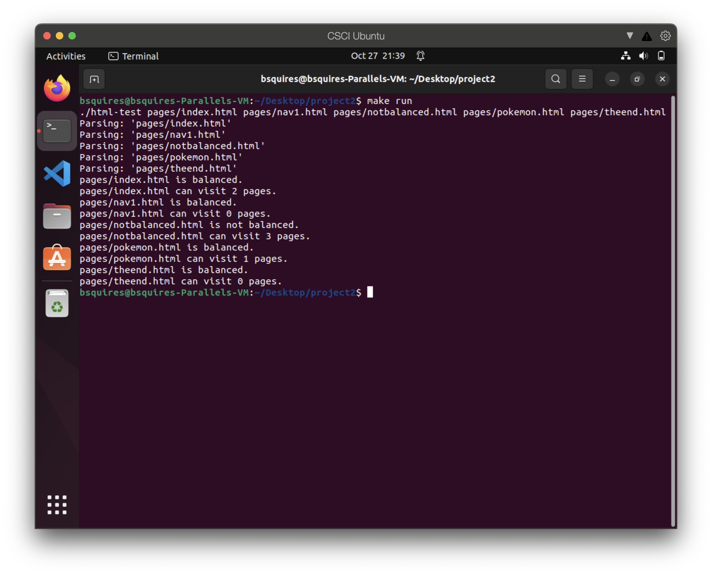

[Back to Portfolio](./)

HTML Parser
===============

-   **Class: Data Structure Analysis** 
-   **Grade: A** 
-   **Language(s): C++** 
-   **Source Code Repository:** [CSCI 315 HTML Parser](https://github.com/rbsquires/HTML-Parser.git)  
    (Please [email me](mailto:rbsquires@csustudent.net?subject=GitHub%20Access) to request access.)

## Project description

This HTML parser was built using C++. The program is used to check that your HTML tags in a page are correctly balanced. It also checks how many unique pages each page can visit. The results are printed into the terminal for each page's balancing and how many pages it can visit.

## How to compile and run the program


To get started, clone the repo:

```bash
cd /project location
make run
```

The included make file allows the user to simply change to the projects location and execute the single command to compile and run the program in the desired terminal.

## UI Design

This is a simple CLI program. Once the user changes to the project's location in the terminal, they can run the program and see the results (see Fig 1).

  
Fig 1. The launch screen

## 3. Additional Considerations

The included HTML pages are located in the "pages" folder. To add/remove pages, include/remove them in the pages folder. Then rerun the "make run" command in the terminal to check the results.

[Back to Portfolio](./)
