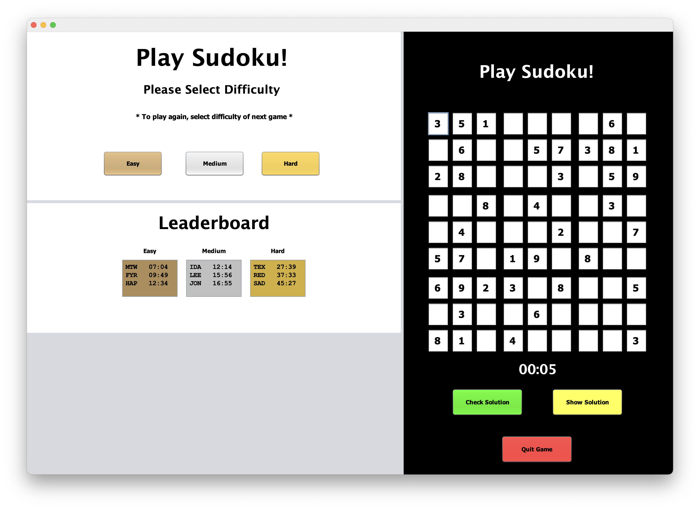
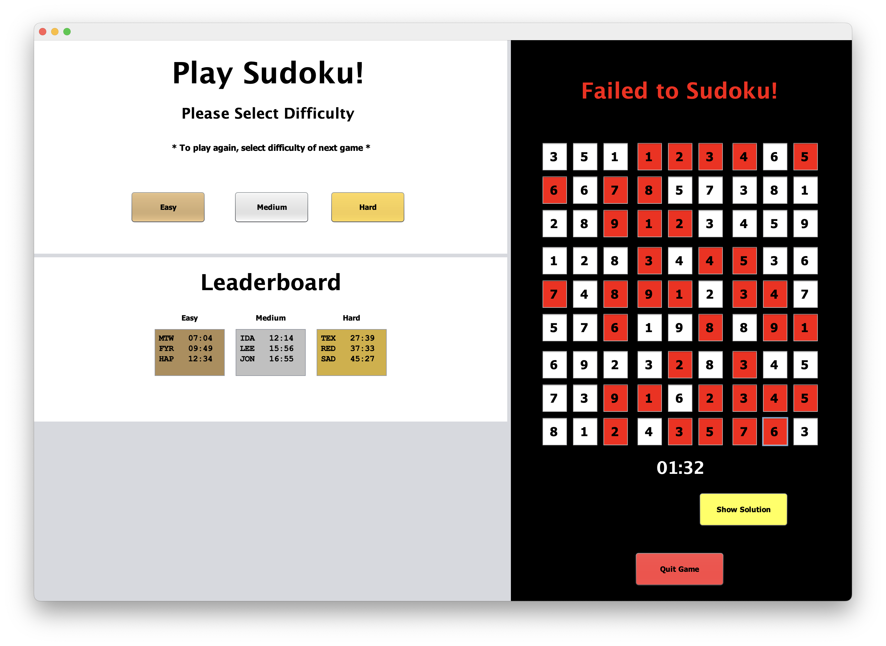
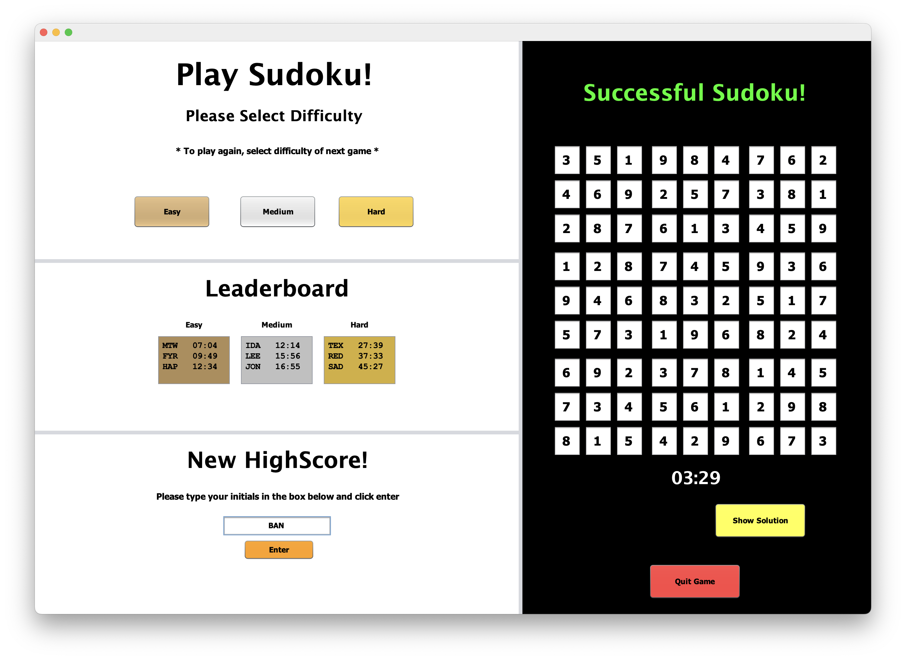
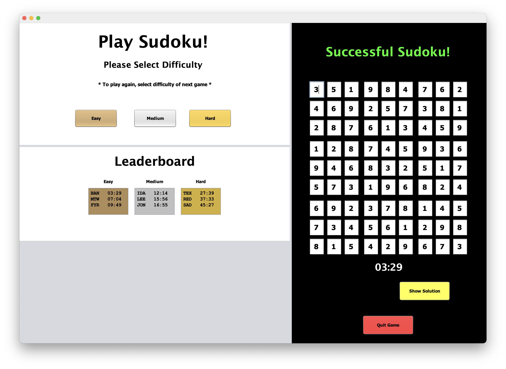

[Back to Portfolio](./)

Sudoku Group Project
===============

-   **Class: Object Oriented Programming (CSCI 325)** 
-   **Group: Mack W., Matt W., Robert S.** 
-   **Grade: A** 
-   **Language(s): Java** 
-   **Source Code Repository:** [features/mastering-markdown](https://github.com/rbsquires/CSCI-325-Sudoku)  
    (Please [email me](mailto:rbsquires@csustudent.net?subject=GitHub%20Access) to request access.)

## Project description

This Sudoku board game was built with Java. Each group was given the chance to pick what their semester project would be, given instructor's approval. We Built an arcade style version of the Sudoku game. It contains different levels of difficulty: easy, medium, and hard. If the player successfully solves the Sudoku puzzle in a quick enough time they will be given the chance to enter their initials into the highscores leaderboard. The application was built with a small amount of boards, but is scalable for the end user. They can download unsolved Sudoku boards and load them into the chosen difficulties file. The boards are chosen at random from the pool in each difficulty level.

## How to run the program

How to compile (if applicable) and run the project.

```bash
cd ./project
python setup.py
```

Clone the repository and open the folder in your desired Java IDE. Ensure that you have your desired JDK loaded in the project. Select the Main.Java file and press the "Play" button in the IDE.

## UI Design

Almost every program requires user interaction, even command-line programs. Include in this section the tasks the user can complete and what the program does. You don't need to include how it works here; that information may go in the project description or in an additional section, depending on its significance.

Lorem ipsum dolor sit amet (see Fig 1), consectetur adipiscing elit, sed do eiusmod tempor incididunt ut labore et dolore magna aliqua. Ut enim ad minim veniam, quis nostrud exercitation ullamco laboris nisi ut aliquip ex ea commodo consequat (see Fig 2). Duis aute irure dolor in reprehenderit in voluptate velit esse cillum dolore eu fugiat nulla pariatur. Excepteur sint occaecat cupidatat non proident, sunt in culpa qui officia deserunt mollit anim id est laborum (see Fig 3).

  
Fig 1. The launch screen

  
Fig 2. Example output after input is processed.

  
Fig 3. Feedback when an error occurs.

  
Fig 4. Feedback when an error occurs.

  
Fig 5. Feedback when an error occurs.

  
Fig 6. Feedback when an error occurs.

  
Fig 7. Feedback when an error occurs.

  
Fig 8. Feedback when an error occurs.

## 3. Additional Considerations

Sed ut perspiciatis unde omnis iste natus error sit voluptatem accusantium doloremque laudantium, totam rem aperiam, eaque ipsa quae ab illo inventore veritatis et quasi architecto beatae vitae dicta sunt explicabo. 

For more details see [GitHub Flavored Markdown](https://guides.github.com/features/mastering-markdown/).

[Back to Portfolio](./)