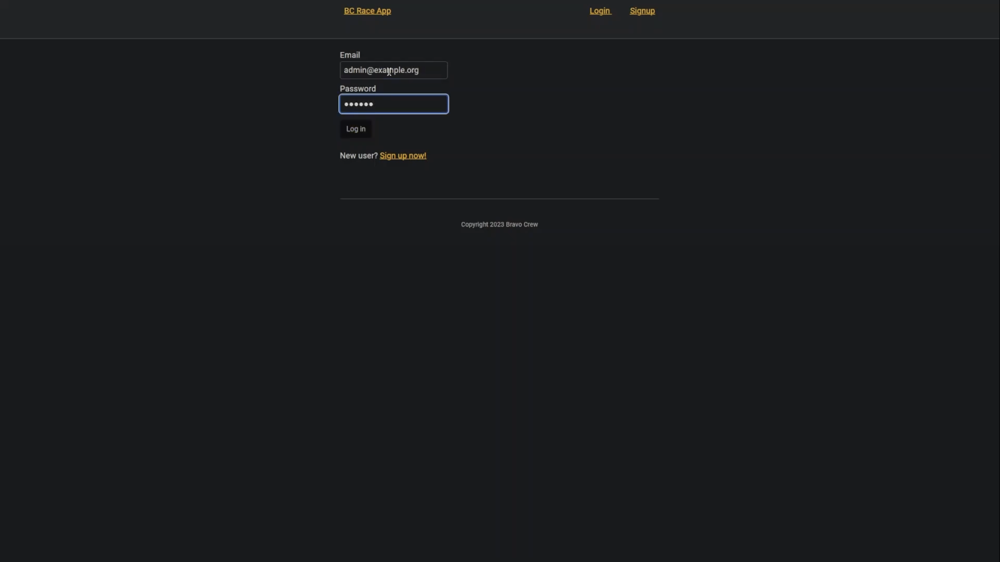
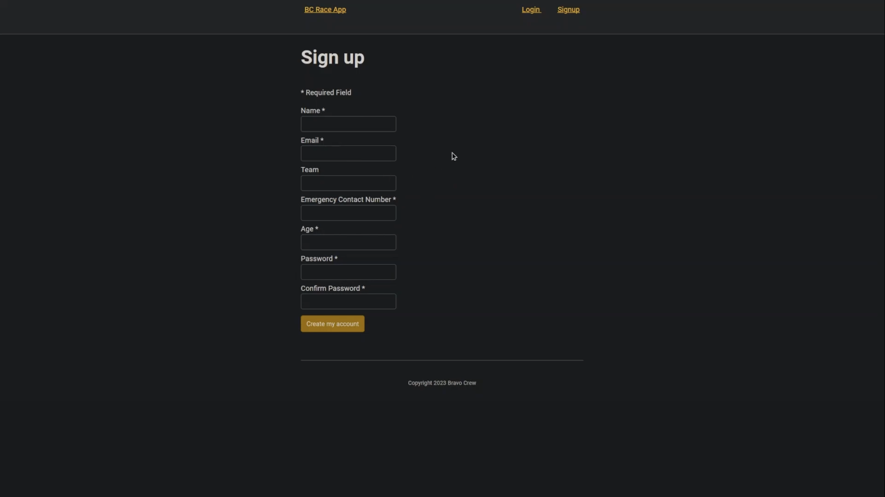
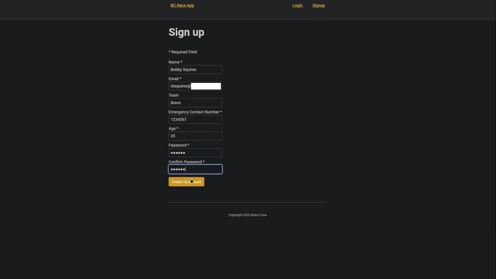
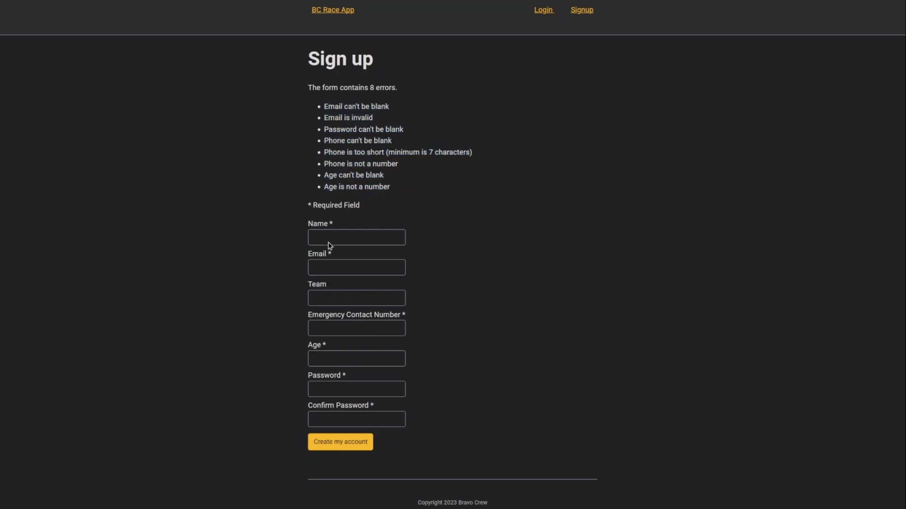
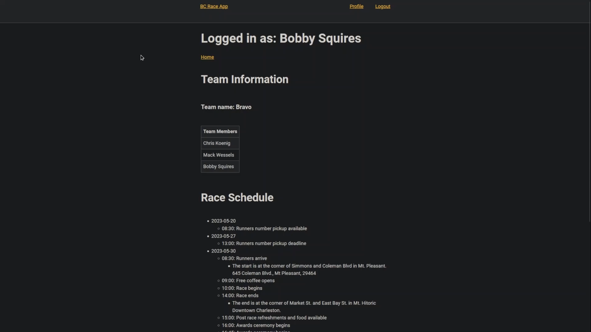
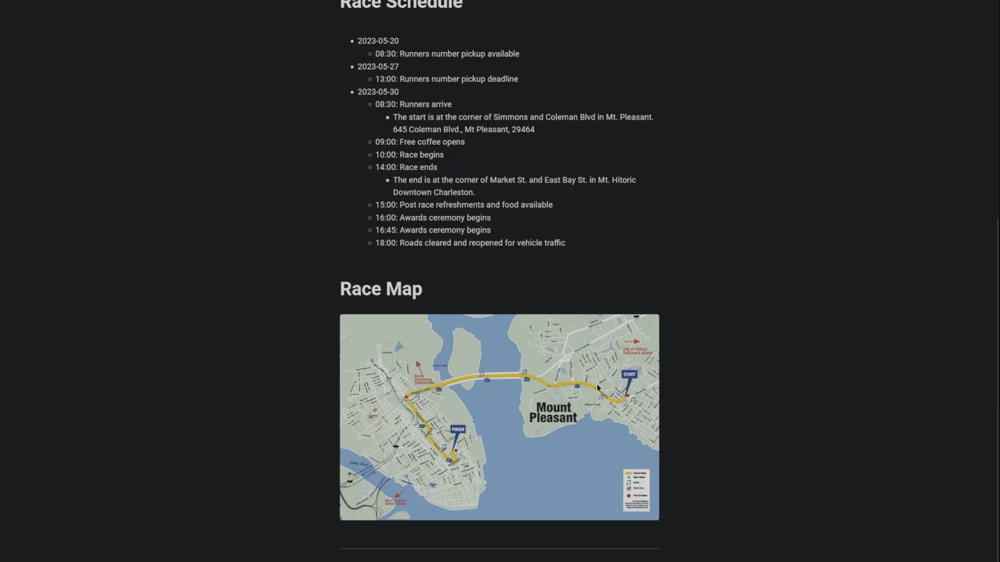
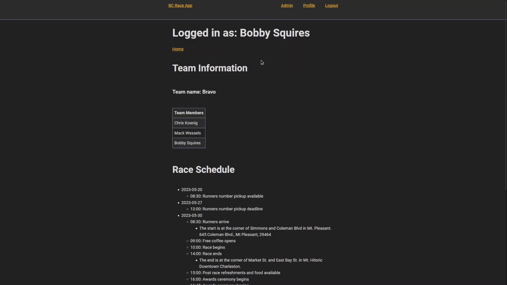
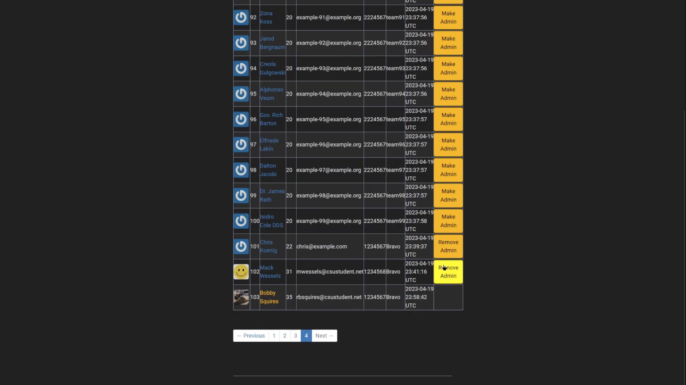

[Back to Portfolio](./)

5k Charity Run Website
===============

-   **Class: User-Interface Programming**
-   **Group: Chris K., Mack W., Robert S.** 
-   **Grade: A** 
-   **Language(s): Ruby and Ruby on Rails** 
-   **Source Code Repository:** [CSCI 334 BC Race Application](https://github.com/rbsquires/BC_race_app.git)  
    (Please [email me](mailto:rbsquires@csustudent.net?subject=GitHub%20Access) to request access.)

## Project description

This charity run website was built with Ruby and Ruby on Rails. The owner of the charity wanted a website developed so that participants could sign up for the race, either individually or as part of a team. The client wanted all users to be greeted with a streamlined website that was easy to navigate and displayed all pertinant information to registered users. This included race events, locations and times. The owner also wanted certain individuals to be granted admin privileges for management purposes.

## How to compile and run the program

To get started, clone the repo and install the needed gems:

```
$ gem install bundler -v 2.3.14
$ bundle _2.3.14_ config set --local without 'production'
$ bundle _2.3.14_ install
```

Next, migrate to your the database to check any changes you have:

```
$ rails db:migrate
```

To seed your database for admin and other user testing:

```
$ rails db:migrate
```

Next, you will point your repository to your Heroku application:

```
$ heroku git:remote -a YOUR HEROKU APP NAME
```

Then, you will push everything to your Heroku production site:

```
$ git push heroku
```

Finally, you will setup the production database on Heroku:

```
$ heroku run rails db:migrate
```


For more information, see the sample tutorial
<a href="https://www.railstutorial.org/book" target="_blank">Ruby on Rails Tutorial</a>


## UI Design

When a user loads the website, they are greeted by the Home page (see Fig 1). If the user is unregistered, they can click the Sign Up link in the description or at the top of the page. Alternatively, if already a registered user they can click the Login link and enter their credentials (see Fig 2).

  
Fig 1. Homepage

  
Fig 2. Log In Page.

Once the new user has clicked the Sign Up link, they will be taken to the Sign Up page (see Fig 3). The user then fills out all required registration fields (see Fig 4). If they have any errors in their entries, or left fields bank, they will be shown a list of the errors (see Fig 5).

  
Fig 3. Sign Up Page.

  
Fig 4. Ready to Sign Up Page.

  
Fig 5. Sign Up Page Errors.

After logging in or creating an account, the user will be taken to their Profile page. The profile page displays the user's name, their team information (if applicable) and race schedule (see Fig 6). It also displays a map of the race route (see Fig 7).


  
Fig 6. Top of Profile Page.

  
Fig 7. Bottom of Profile Page.

If the user has admin privileges, they will have an Admin link at the top of their profile page (see Fig 8). If the admin wants to grant or remove admin privileges to other registered user, they may do so after clicking the Admin link at the top, and navigating to the user's name, then clicking the Add/Remove Admin button next to the user (see Fig 9).

  
Fig 8. Admin Profile Page.

  
Fig 9. Add/Remove Admin Privileges.

[Back to Portfolio](./)
