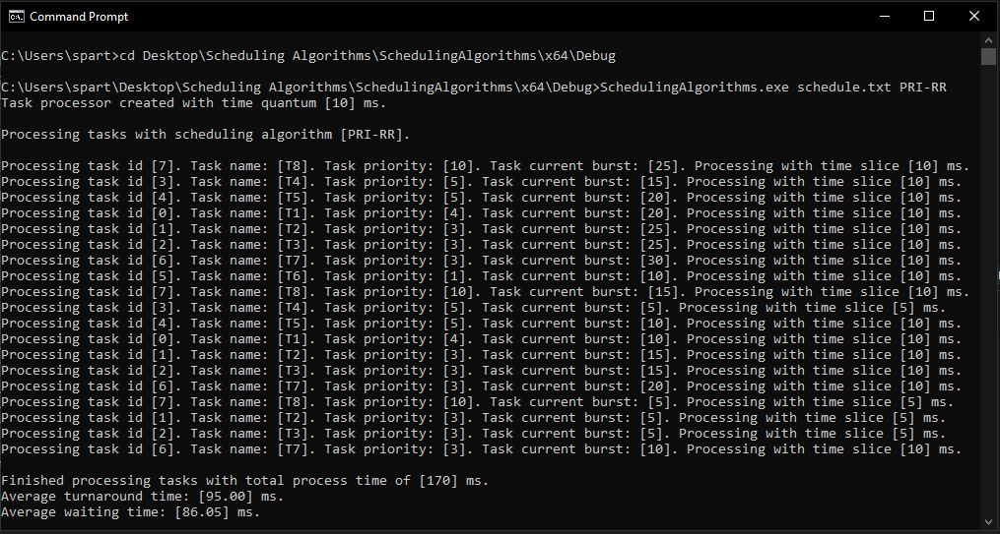
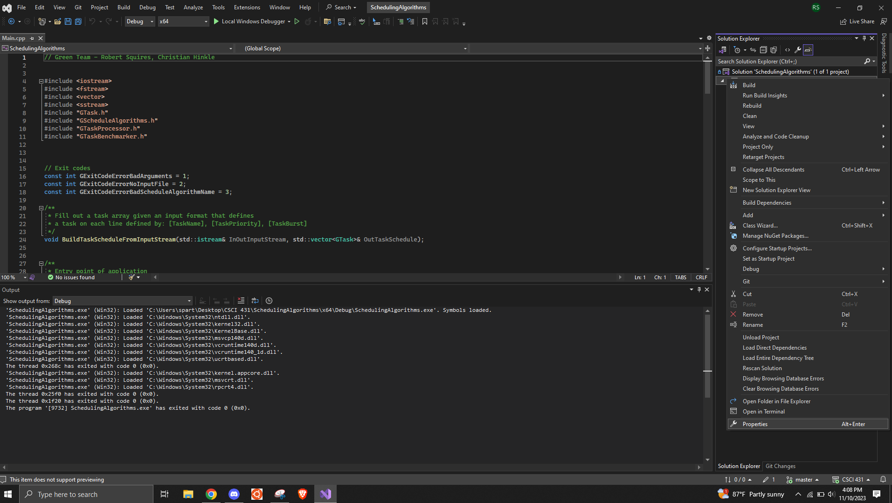
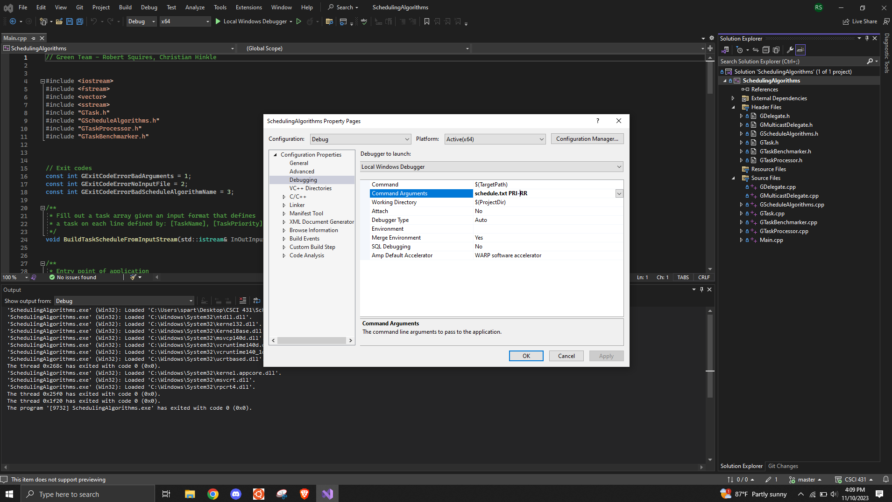

[Back to Portfolio](./)

Scheduling Algorithm
===============

-   **Class: Operating Systems**
-   **Group: Christian H., Robert S.** 
-   **Grade: A** 
-   **Language(s): C++** 
-   **Source Code Repository:** [features/mastering-markdown](https://github.com/rbsquires/SortingAlgorithms.git)  
    (Please [email me](mailto:rbsquires@csustudent.net?subject=GitHub%20Access) to request access.)

## Project description

This program is a scheduling algrothims for a CPU built with C++. The program contains different scheduling algorithms used for determing the processing of tasks by the CPU, including: First-come first-served (FCFS), Shortest-job-first (SJF), Priority scheduling (PRI), Round-robin (RR) scheduling, Priority with round-robin (PRI-RR). The tasks contain an ID, priority and burst time. The selected task list and scheduling algorithm are run together to show the CPU operations for the given scheduling type.

## How to compile and run the program
#### \* This program requires the use of Visual Studio *

To get started, clone the repo:

In Windows cmd:
```bash
cd /project location
SchedulingAlgorithm.exe "desired text file" "desire algorithm"
```
For more information, reference the
<a href="https://learn.microsoft.com/en-us/cpp/build/vscpp-step-2-build?view=msvc-170" target="_blank">Microsoft Instructions</a>

## UI Design

There are two ways to run this program, both requiring Visual Studio to be installed:

The user selected task file and scheduling algorithm are input as arguements in the Windows cmd terminal and the algorithm's output is displayed in the terminal (see Fig 1).

  
Fig 1. The Sorting Algorithm Results.

Alternatively, the user can run the program in the Visual Studio IDE. Load the project into Visual Studio. Right-click on the project folder inside the Solution Explorer pane on the right, and click Properties (see Fig 2). Then inside the properties window, click on Debugging. Enter the "desired task file" "desired algorithm" next to Command Arguments and click Ok (see Fig 3). Then click "Local Windows Debugger" button at the top of the IDE.

  
Fig 2. Preferences in Visual Studio.

  
Fig 3. Setting Arguments in Visual Studio.


## 3. Additional Considerations

Knowledge of running Visual Studio C++ executables is recommended for this project. If the user can run the program from the command line, it is much quicker to run the different task list/algorithm combinations. Using the Visual Studio IDE is much more time consuming, because each set of arguments needs to be entered into the properties window between swapping task list/algorithm combinations. 

[Back to Portfolio](./)