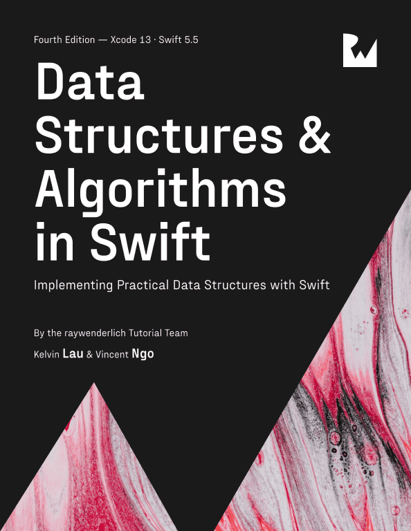

[Back to Portfolio](./)

Swift Data Structures and Algorithms
===============

-   **Language(s): Swift and SwiftUI** 
-   **Source Code Repository:** [SwiftDSA](https://github.com/rbsquires/SwiftDSA)  
    (Please [email me](mailto:rbsquires@csustudent.net?subject=GitHub%20Access) to request access.)

## Project description

Learning to do Data Structures and Algorithms in Swift.

*Fig 1. Under Construction, will update as I progress through the book*

[Back to Portfolio](./)