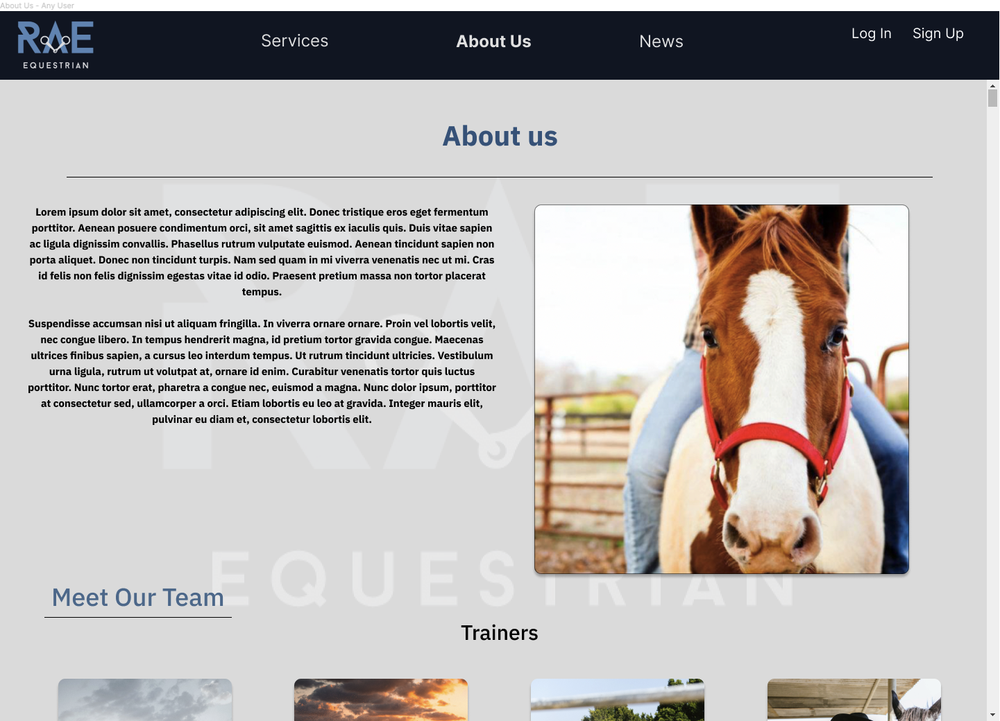
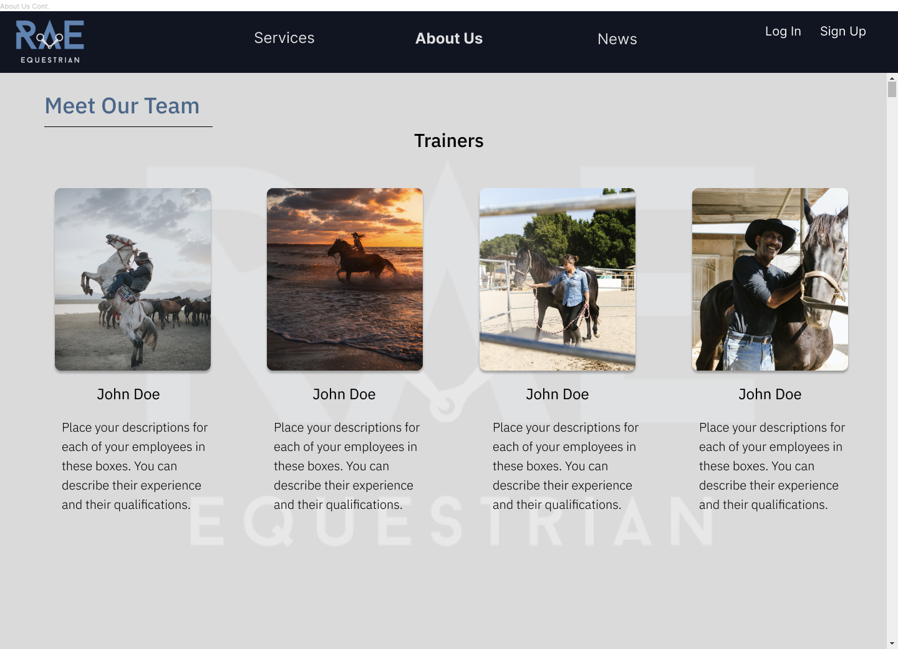
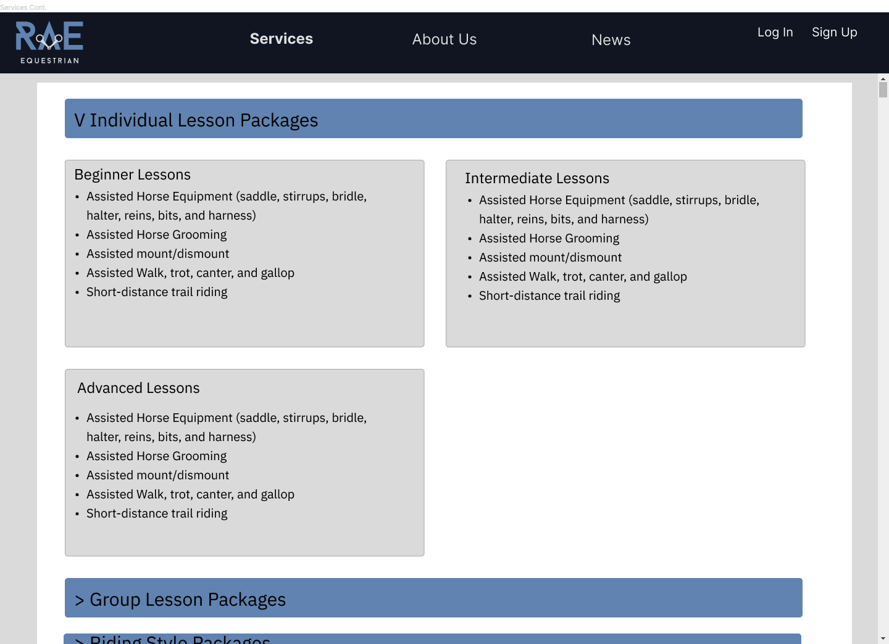
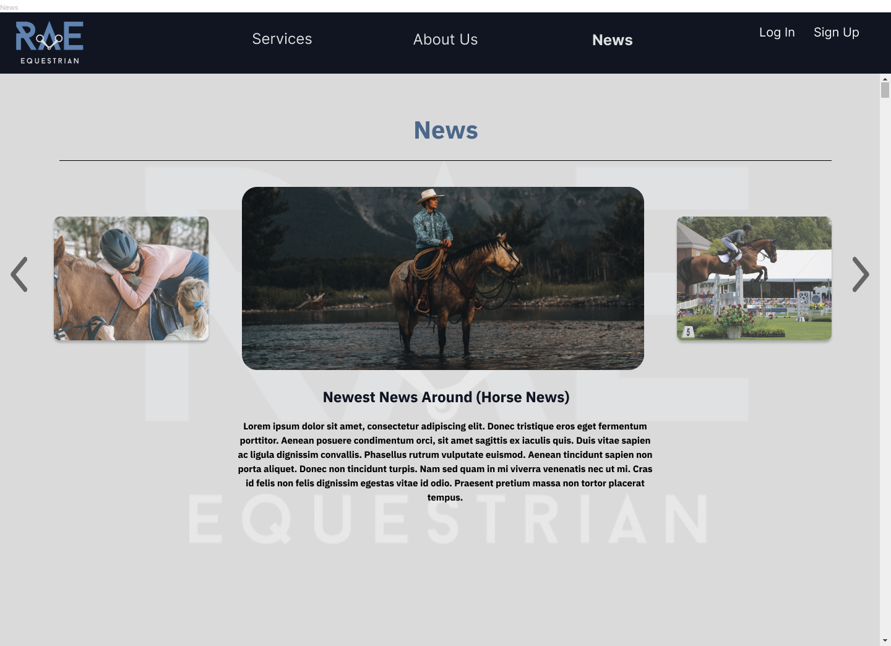
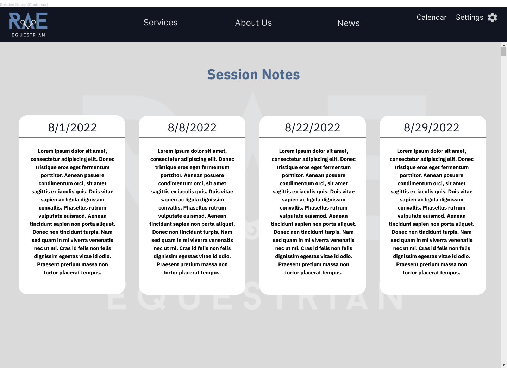
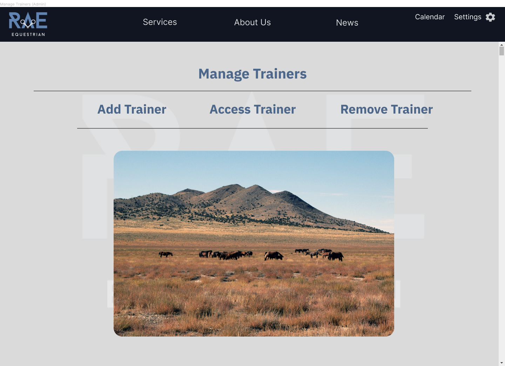
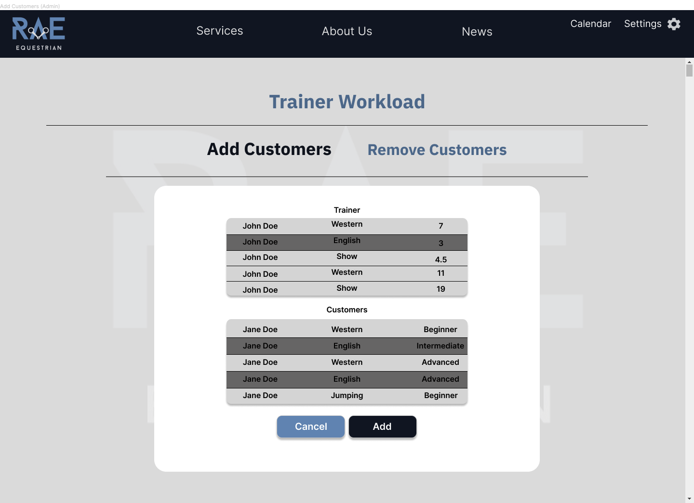

[Back to Portfolio](./)

Rae's Riding Lessons Website Design
===============

-   **Class: Systems Design & Software Analysis** 
-   **Grade: A** 
-   **Tool(s): Figma**  
    (Please [email me](mailto:rbsquires@csustudent.net?subject=GitHub%20Access) to request access.)

## Project description

This project was for website for a small business that does horse riding lessons. It was a group project but I was in charge of the GUI Mockups. The requirements were for customer registration and lesson sign up on a calendar. Riding lesson trainer scheduling by the business admin, and an admin profile that could delegate admin privileges as well as edit the calendar for customers and trainers.

## UI Design

I designed the About Us page to be welcoming and informative for those interested in local horse riding lessons (see Fig 1).

  
*Fig 1. The About Us/Home page*

The user can scroll down to see information about the various trainers on staff (see Fig 2).

  
*Fig 2. The About Us/Trainer page*

All users on the website can view the services offered page of the website, by clicking the Services link in the header. The page is designed to expand for each style of riding (see Fig 3).

  
*Fig 3. The Services page*

All users can also view the recent news pages that the company has posted by clicking the News link in the header. The user can navigate throught the different articles by clicking the left or right arrows (see Fig 4).

  
*Fig 4. The News page*

Registered users can view the lesson calendar and select which open slot they would like to sign up for (see Fig 5).

  
*Fig 5. The Calendar page*

Registered users can view their recent riding lesson notes that their trainer has entered (see Fig 6).

  
*Fig 6. The Session Notes page*

The Admin user(s) can manage the business by altering trainers on staff (see Fig 7).

  
*Fig 7. Admin's Trainer Management page*

The Admin can also manage the trainer(s) schedule by adding or removing customers to lessons (see Fig 8).

  
*Fig 8. Admin's Trainer Workload page*

[Back to Portfolio](./)
